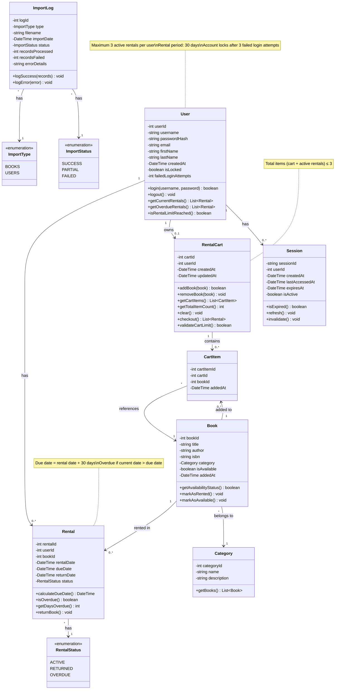

# BORK - Conceptual Class Diagram

This document presents the conceptual model for the BORK (Book Organization & Rental Kiosk) system using a UML class diagram. The model represents the core domain entities, their attributes, relationships, and multiplicities.

## Class Diagram

## Entity Descriptions

### User

Represents a student who can browse books, manage rentals, and receive notifications. Users are authenticated and subject to rental limits.

**Key Business Rules:**

- Maximum 3 active rentals at any time
- Account locks after 3 failed login attempts
- Session timeout after 30 minutes of inactivity

### Book

Represents a physical book in the library inventory. Books can be available or rented, and belong to a specific category.

**Key Business Rules:**

- A book can only be rented by one user at a time
- Availability status is updated in real-time
- Books are managed through CSV/JSON imports

### Category

Represents a classification/genre for books (e.g., Fiction, Science, History). Helps users filter and browse books.

### Rental

Represents an active or historical rental transaction. Tracks when a book was rented, when it's due, and when it was returned.

**Key Business Rules:**

- Rental period is exactly 30 days
- Due date is automatically calculated as rental date + 30 days
- Status changes from ACTIVE to RETURNED when book is returned
- Status is OVERDUE if current date > due date and not yet returned

### RentalCart

Represents a user's shopping cart for books they intend to rent. Follows an e-commerce pattern where users can add/remove books before checkout.

**Key Business Rules:**

- Each user has at most one active cart
- Total items in cart + active rentals cannot exceed 3
- Cart is cleared after successful checkout
- Books in cart must still be available at checkout

### CartItem

Represents an individual book added to a rental cart. Links the cart to specific books.

### Session

Represents an authenticated user session. Manages login state and session expiration.

**Key Business Rules:**

- Sessions expire after 30 minutes of inactivity
- Only one active session per user (optional constraint)
- Sessions are invalidated on logout

### ImportLog

Tracks the history of CSV/JSON file imports for books and users. Provides audit trail and error tracking.

**Key Business Rules:**

- Records both successful and failed imports
- Maintains error details for troubleshooting
- Supports partial imports (some records succeed, some fail)

## Enumerations

### RentalStatus

- **ACTIVE**: Book is currently rented and not yet returned
- **RETURNED**: Book has been returned
- **OVERDUE**: Book is past due date and not yet returned

### ImportType

- **BOOKS**: Import of book inventory data
- **USERS**: Import of user account data

### ImportStatus

- **SUCCESS**: All records imported successfully
- **PARTIAL**: Some records imported, some failed
- **FAILED**: Import completely failed

## Key Relationships

### User ↔ Rental (1 to 0..\*)

- A user can have zero or more rentals (current and historical)
- Each rental belongs to exactly one user
- **Constraint**: Maximum 3 ACTIVE rentals per user

### User ↔ RentalCart (1 to 0..1)

- A user can have at most one rental cart
- A cart belongs to exactly one user

### Book ↔ Category (\* to 1)

- Each book belongs to exactly one category
- A category can have zero or more books

### Book ↔ Rental (1 to 0..\*)

- A book can have zero or more rental records (historical)
- Each rental is for exactly one book
- **Constraint**: Only one ACTIVE rental per book at a time

### RentalCart ↔ CartItem (1 to 0..\*)

- A cart contains zero or more items
- Each cart item belongs to exactly one cart

### CartItem ↔ Book (\* to 1)

- Each cart item references exactly one book
- A book can be in zero or more carts (but typically just one)

## Architectural Layers

This conceptual model will be implemented across three layers:

### Presentation Layer

- User interface components
- Session management
- Input validation and sanitization

### Business Layer

- Business logic for rental rules (3-book limit, 30-day period)
- Overdue calculation
- Cart management
- Authentication and authorization
- Import processing

### Data Layer

- ORM entities mapping to database tables
- Repository pattern for data access
- Transaction management
- Data validation

## Notes

- All date/time fields use UTC timezone
- Password storage uses bcrypt hashing (minimum cost factor 12)
- The model enforces referential integrity through foreign key relationships
- Audit fields (createdAt, updatedAt) support tracking and debugging
- The design supports future extensions (e.g., book reservations, notifications)
