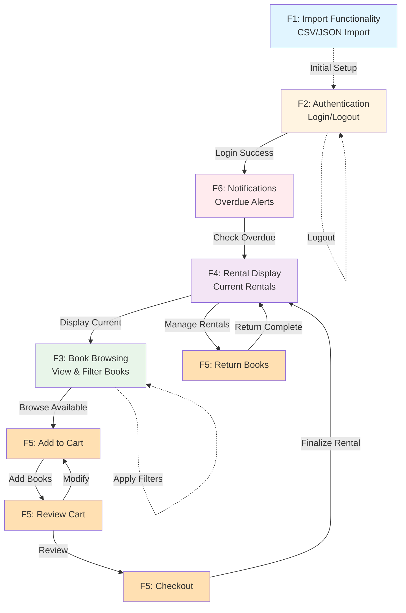

# BORK Feature Flow Diagram

This diagram illustrates the flow and interactions between features in the BORK (Book Organization & Rental Kiosk) system.

## Legend

- Solid arrows (→) indicate primary user flow
- Dashed arrows (-.→) indicate setup, optional, or cyclic actions
- Colors distinguish different feature categories

## Flow Description

1. **F1 (Import)**: Initial setup of books and users via CSV/JSON import
2. **F2 (Authentication)**: User login entry point
3. **F6 (Notifications)**: Immediate check for overdue books after login
4. **F4 (Rental Display)**: Shows current rentals at the top
5. **F3 (Book Browsing)**: Main interface for viewing and filtering available books
6. **F5 (Book Rental)**: Shopping cart flow with multiple steps:
   - Add books to cart
   - Review cart (can modify by going back to add/remove)
   - Checkout to finalize rental
   - Return books to make them available again
