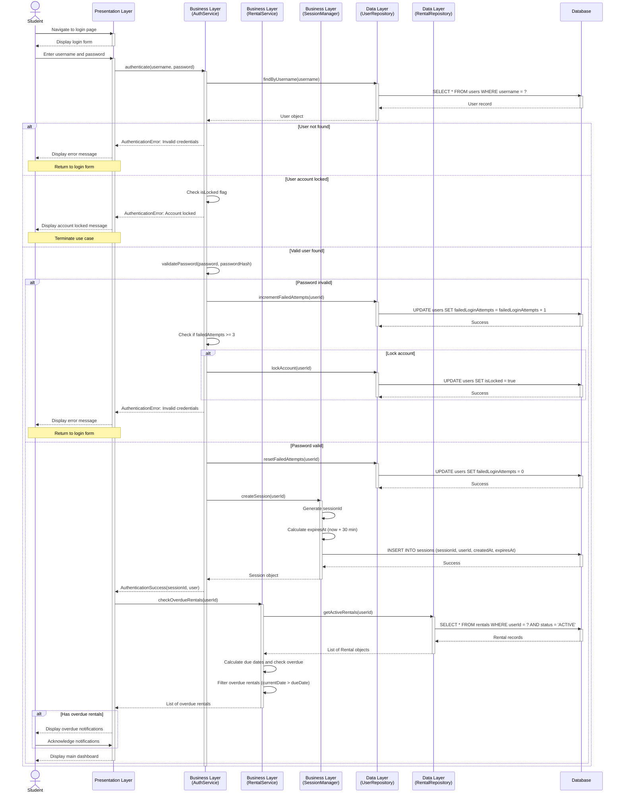

# BORK - Login Sequence Diagram

This document presents the sequence diagram for the login process in the BORK (Book Organization & Rental Kiosk) system, illustrating the interactions between the user, presentation layer, business layer, and data layer.

## Related Use Cases

- **UC-2: Login** - Primary use case
- **UC-12: View Overdue Notifications** - Included in login flow

## Sequence Diagram

## Sequence Description

### Normal Flow

1. **Student navigates to login page**

   - Student requests access to the BORK system
   - Presentation layer displays the login form

2. **Student enters credentials**

   - Student inputs username and password
   - Presentation layer sends credentials to AuthService

3. **User lookup**

   - AuthService requests UserRepository to find user by username
   - UserRepository queries database for user record
   - Database returns user data (if found)

4. **Credential validation**

   - AuthService validates the password against stored hash using bcrypt
   - If valid, failed login attempts are reset to 0

5. **Session creation**

   - AuthService requests SessionManager to create new session
   - SessionManager generates unique sessionId
   - Session expiration time is set to 30 minutes from creation
   - Session record is persisted to database

6. **Overdue rental check**

   - Presentation layer requests RentalService to check for overdue rentals
   - RentalService retrieves all active rentals for the user
   - RentalService calculates due dates (rental date + 30 days)
   - RentalService identifies rentals where current date > due date

7. **Display results**
   - If overdue rentals exist, notifications are displayed
   - Student acknowledges notifications
   - Main dashboard is displayed

### Exception Flows

#### E1: Invalid Credentials

- User not found or password doesn't match
- Failed login attempts counter is incremented
- If attempts reach 3, account is locked
- Error message displayed to student

#### E2: Account Locked

- System detects `isLocked` flag is true
- Account locked message displayed
- Use case terminates

## Key Components

### Presentation Layer

- **UI**: Handles user interface, form display, and user interactions

### Business Layer

- **AuthService**: Manages authentication logic, password validation, and account locking
- **RentalService**: Handles rental business logic including overdue calculations
- **SessionManager**: Manages session creation, validation, and expiration

### Data Layer

- **UserRepository**: Data access for user entities
- **RentalRepository**: Data access for rental entities
- **Database**: Persistent storage

## Business Rules Enforced

1. **Password Validation**: Passwords are hashed using bcrypt (minimum cost factor 12)
2. **Account Lockout**: Account locks after 3 consecutive failed login attempts
3. **Session Expiration**: Sessions expire after 30 minutes of inactivity
4. **Overdue Calculation**: Rentals are overdue if current date > (rental date + 30 days)
5. **Automatic Notification**: Overdue rentals are automatically checked and displayed on login

## Security Considerations

- Passwords are never stored in plaintext
- Password validation uses secure hashing (bcrypt)
- Failed login attempts are tracked to prevent brute force attacks
- Sessions have automatic expiration
- Generic error messages prevent username enumeration
