# BORK - Rent Book Sequence Diagram

This document presents the sequence diagram for the book rental process in the BORK (Book Organization & Rental Kiosk) system, illustrating the complete workflow from browsing books to finalizing a rental.

## Related Use Cases

- **UC-4: View Available Books**
- **UC-5: Filter Books**
- **UC-7: Add Book to Cart**
- **UC-8: Review Rental Cart**
- **UC-9: Remove Book from Cart**
- **UC-10: Checkout Rental**
- **UC-6: View Current Rentals**

## Sequence Diagram

```mermaid
sequenceDiagram
    actor Student
    participant UI as Presentation Layer
    participant BookService as Business Layer<br/>(BookService)
    participant CartService as Business Layer<br/>(CartService)
    participant RentalService as Business Layer<br/>(RentalService)
    participant BookRepo as Data Layer<br/>(BookRepository)
    participant CartRepo as Data Layer<br/>(CartRepository)
    participant RentalRepo as Data Layer<br/>(RentalRepository)
    participant DB as Database

    Note over Student,DB: Phase 1: Browse and Filter Books

    Student->>UI: Request to view available books
    activate UI
    UI->>BookService: getAvailableBooks()
    activate BookService
    BookService->>BookRepo: findAllBooks()
    activate BookRepo
    BookRepo->>DB: SELECT * FROM books
    activate DB
    DB-->>BookRepo: Book records
    deactivate DB
    BookRepo-->>BookService: List of Book objects
    deactivate BookRepo
    BookService->>BookService: Filter by availability status
    BookService-->>UI: List of available books
    deactivate BookService
    UI-->>Student: Display book list
    deactivate UI

    opt Student applies filters
        Student->>UI: Apply filter (title/author/category)
        activate UI
        UI->>BookService: filterBooks(filterCriteria)
        activate BookService
        BookService->>BookRepo: findBooksByFilter(criteria)
        activate BookRepo
        BookRepo->>DB: SELECT * FROM books WHERE ...
        activate DB
        DB-->>BookRepo: Filtered book records
        deactivate DB
        BookRepo-->>BookService: Filtered books
        deactivate BookRepo
        BookService-->>UI: Filtered book list
        deactivate BookService
        UI-->>Student: Display filtered results
        deactivate UI
    end

    Note over Student,DB: Phase 2: Add Books to Cart

    Student->>UI: Select book and add to cart
    activate UI
    UI->>CartService: addBookToCart(userId, bookId)
    activate CartService

    CartService->>BookRepo: findById(bookId)
    activate BookRepo
    BookRepo->>DB: SELECT * FROM books WHERE bookId = ?
    activate DB
    DB-->>BookRepo: Book record
    deactivate DB
    BookRepo-->>CartService: Book object
    deactivate BookRepo

    CartService->>CartService: Check if book.isAvailable == true

    alt Book not available
        CartService-->>UI: Error: Book not available
        UI-->>Student: Display unavailable message
        Note over Student,UI: Terminate add to cart
    else Book available
        CartService->>RentalRepo: countActiveRentals(userId)
        activate RentalRepo
        RentalRepo->>DB: SELECT COUNT(*) FROM rentals WHERE userId = ? AND status = 'ACTIVE'
        activate DB
        DB-->>RentalRepo: Active rental count
        deactivate DB
        RentalRepo-->>CartService: rentalCount
        deactivate RentalRepo

        CartService->>CartRepo: getCartItemCount(userId)
        activate CartRepo
        CartRepo->>DB: SELECT COUNT(*) FROM cart_items WHERE cartId IN (SELECT cartId FROM rental_carts WHERE userId = ?)
        activate DB
        DB-->>CartRepo: Cart item count
        deactivate DB
        CartRepo-->>CartService: cartItemCount
        deactivate CartRepo

        CartService->>CartService: Check if (rentalCount + cartItemCount) < 3

        alt Rental limit reached
            CartService-->>UI: Error: Rental limit reached (3 books max)
            UI-->>Student: Display limit reached message
            Note over Student,UI: Suggest returning books or removing cart items
        else Limit not reached
            CartService->>CartRepo: getOrCreateCart(userId)
            activate CartRepo
            CartRepo->>DB: SELECT * FROM rental_carts WHERE userId = ?
            activate DB
            DB-->>CartRepo: Cart record (or null)
            deactivate DB

            alt Cart doesn't exist
                CartRepo->>DB: INSERT INTO rental_carts (userId, createdAt)
                activate DB
                DB-->>CartRepo: New cart created
                deactivate DB
            end

            CartRepo-->>CartService: Cart object
            deactivate CartRepo

            CartService->>CartRepo: addCartItem(cartId, bookId)
            activate CartRepo
            CartRepo->>DB: INSERT INTO cart_items (cartId, bookId, addedAt)
            activate DB
            DB-->>CartRepo: Success
            deactivate DB
            CartRepo-->>CartService: CartItem created
            deactivate CartRepo

            CartService-->>UI: Success: Book added to cart
            UI-->>Student: Display confirmation and update cart count
        end
    end
    deactivate CartService
    deactivate UI

    Note over Student,DB: Phase 3: Review and Modify Cart

    opt Student reviews cart
        Student->>UI: Navigate to cart
        activate UI
        UI->>CartService: getCartItems(userId)
        activate CartService
        CartService->>CartRepo: getCartWithItems(userId)
        activate CartRepo
        CartRepo->>DB: SELECT ci.*, b.* FROM cart_items ci JOIN books b ON ci.bookId = b.bookId WHERE ci.cartId IN (SELECT cartId FROM rental_carts WHERE userId = ?)
        activate DB
        DB-->>CartRepo: Cart items with book details
        deactivate DB
        CartRepo-->>CartService: List of CartItem objects
        deactivate CartRepo
        CartService-->>UI: Cart items
        deactivate CartService
        UI-->>Student: Display cart contents
        deactivate UI

        opt Student removes item
            Student->>UI: Remove book from cart
            activate UI
            UI->>CartService: removeBookFromCart(userId, bookId)
            activate CartService
            CartService->>CartRepo: deleteCartItem(cartId, bookId)
            activate CartRepo
            CartRepo->>DB: DELETE FROM cart_items WHERE cartId = ? AND bookId = ?
            activate DB
            DB-->>CartRepo: Success
            deactivate DB
            CartRepo-->>CartService: Item removed
            deactivate CartRepo
            CartService-->>UI: Success
            deactivate CartService
            UI-->>Student: Display updated cart
            deactivate UI
        end
    end

    Note over Student,DB: Phase 4: Checkout and Finalize Rental

    Student->>UI: Proceed to checkout
    activate UI
    UI->>RentalService: checkoutCart(userId)
    activate RentalService

    RentalService->>CartRepo: getCartWithItems(userId)
    activate CartRepo
    CartRepo->>DB: SELECT cart items
    activate DB
    DB-->>CartRepo: Cart items
    deactivate DB
    CartRepo-->>RentalService: List of cart items
    deactivate CartRepo

    alt Cart is empty
        RentalService-->>UI: Error: Cart is empty
        UI-->>Student: Display empty cart message
        Note over Student,UI: Terminate checkout
    else Cart has items
        RentalService->>RentalService: Validate all books still available
        RentalService->>BookRepo: checkBooksAvailability(bookIds)
        activate BookRepo
        BookRepo->>DB: SELECT bookId, isAvailable FROM books WHERE bookId IN (?)
        activate DB
        DB-->>BookRepo: Book availability status
        deactivate DB
        BookRepo-->>RentalService: Availability map
        deactivate BookRepo

        alt Some books unavailable
            RentalService->>CartRepo: removeUnavailableBooks(cartId, unavailableBookIds)
            activate CartRepo
            CartRepo->>DB: DELETE FROM cart_items WHERE bookId IN (?)
            activate DB
            DB-->>CartRepo: Success
            deactivate DB
            deactivate CartRepo
            RentalService-->>UI: Warning: Some books removed (unavailable)
            UI-->>Student: Display updated cart, prompt to review
            Note over Student,UI: Return to cart review
        else All books available
            RentalService->>RentalRepo: countActiveRentals(userId)
            activate RentalRepo
            RentalRepo->>DB: SELECT COUNT(*) FROM rentals WHERE userId = ? AND status = 'ACTIVE'
            activate DB
            DB-->>RentalRepo: Active rental count
            deactivate DB
            RentalRepo-->>RentalService: rentalCount
            deactivate RentalRepo

            RentalService->>RentalService: Validate (rentalCount + cartItemCount) <= 3

            alt Would exceed limit
                RentalService-->>UI: Error: Checkout would exceed rental limit
                UI-->>Student: Display error, prompt to remove items
                Note over Student,UI: Terminate checkout
            else Within limit
                RentalService->>DB: BEGIN TRANSACTION
                activate DB

                loop For each book in cart
                    RentalService->>RentalService: Calculate rentalDate = now()
                    RentalService->>RentalService: Calculate dueDate = rentalDate + 30 days

                    RentalService->>RentalRepo: createRental(userId, bookId, rentalDate, dueDate)
                    activate RentalRepo
                    RentalRepo->>DB: INSERT INTO rentals (userId, bookId, rentalDate, dueDate, status) VALUES (?, ?, ?, ?, 'ACTIVE')
                    DB-->>RentalRepo: Rental created
                    deactivate RentalRepo

                    RentalService->>BookRepo: updateAvailability(bookId, false)
                    activate BookRepo
                    BookRepo->>DB: UPDATE books SET isAvailable = false WHERE bookId = ?
                    DB-->>BookRepo: Success
                    deactivate BookRepo
                end

                RentalService->>CartRepo: clearCart(userId)
                activate CartRepo
                CartRepo->>DB: DELETE FROM cart_items WHERE cartId IN (SELECT cartId FROM rental_carts WHERE userId = ?)
                DB-->>CartRepo: Success
                deactivate CartRepo

                RentalService->>DB: COMMIT TRANSACTION
                deactivate DB

                RentalService->>RentalRepo: getActiveRentals(userId)
                activate RentalRepo
                RentalRepo->>DB: SELECT r.*, b.* FROM rentals r JOIN books b ON r.bookId = b.bookId WHERE r.userId = ? AND r.status = 'ACTIVE'
                activate DB
                DB-->>RentalRepo: Active rentals with book details
                deactivate DB
                RentalRepo-->>RentalService: List of current rentals
                deactivate RentalRepo

                RentalService-->>UI: Success: Rentals created, current rentals list
                deactivate RentalService
                UI-->>Student: Display success message and current rentals with due dates
                deactivate UI
            end
        end
    end
```

## Sequence Description

### Phase 1: Browse and Filter Books

1. **View available books**

   - Student requests to view books
   - BookService retrieves all books from database
   - Books are filtered by availability status
   - Book list is displayed to student

2. **Apply filters (optional)**
   - Student can filter by title, author, or category
   - BookService queries database with filter criteria
   - Filtered results are displayed

### Phase 2: Add Books to Cart

1. **Book selection**

   - Student selects a book to add to cart
   - CartService validates book availability

2. **Availability check**

   - System verifies `isAvailable` flag is true
   - If unavailable, error message is displayed

3. **Rental limit validation**

   - System counts active rentals for user
   - System counts current cart items
   - Total must be less than 3

4. **Add to cart**
   - System retrieves or creates cart for user
   - CartItem is created linking cart to book
   - Confirmation message displayed

### Phase 3: Review and Modify Cart

1. **View cart contents**

   - Student navigates to cart
   - CartService retrieves all cart items with book details
   - Cart contents displayed

2. **Remove items (optional)**
   - Student can remove books from cart
   - CartItem is deleted from database
   - Updated cart is displayed

### Phase 4: Checkout and Finalize Rental

1. **Initiate checkout**

   - Student proceeds to checkout
   - RentalService retrieves cart items

2. **Final validation**

   - System re-validates all books are still available
   - If any book became unavailable, it's removed from cart
   - System validates rental limit one final time

3. **Create rentals (transaction)**

   - Database transaction begins
   - For each book in cart:
     - Rental record created with status 'ACTIVE'
     - Due date calculated as rental date + 30 days
     - Book availability updated to false
   - Cart is cleared
   - Transaction committed

4. **Display results**
   - Current rentals retrieved and displayed
   - Success message with due dates shown

## Key Components

### Presentation Layer

- **UI**: Handles user interface, displays books, cart, and rental information

### Business Layer

- **BookService**: Manages book browsing, filtering, and availability
- **CartService**: Handles cart operations and rental limit validation
- **RentalService**: Manages rental creation, checkout, and business rules

### Data Layer

- **BookRepository**: Data access for book entities
- **CartRepository**: Data access for cart and cart item entities
- **RentalRepository**: Data access for rental entities
- **Database**: Persistent storage with transaction support

## Business Rules Enforced

1. **Availability Check**: Books can only be added if `isAvailable = true`
2. **Rental Limit**: Maximum 3 books (active rentals + cart items) per user
3. **Rental Period**: Exactly 30 days from rental date
4. **Transaction Integrity**: Checkout uses database transaction to ensure atomicity
5. **Re-validation**: Books are re-checked for availability at checkout
6. **Cart Cleanup**: Cart is cleared after successful checkout

## Exception Handling

- **Book Unavailable**: Prevents adding unavailable books to cart
- **Rental Limit Reached**: Prevents exceeding 3-book limit
- **Empty Cart**: Prevents checkout with no items
- **Books Became Unavailable**: Removes unavailable books and prompts user to review
- **Transaction Rollback**: If any step fails during checkout, all changes are rolled back

## Performance Considerations

- Book availability is checked in real-time
- Cart operations use efficient queries with joins
- Checkout process is optimized with a single transaction
- Rental count queries use indexed fields for fast execution
