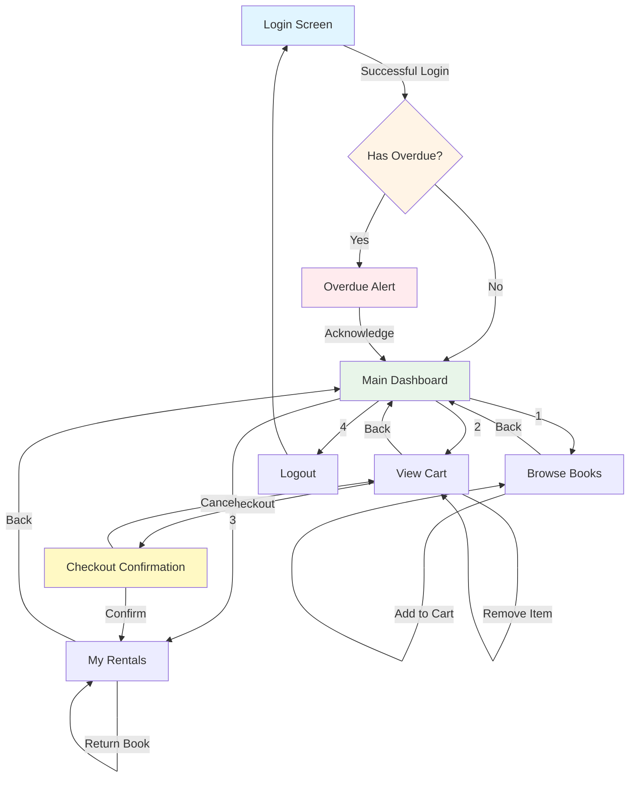
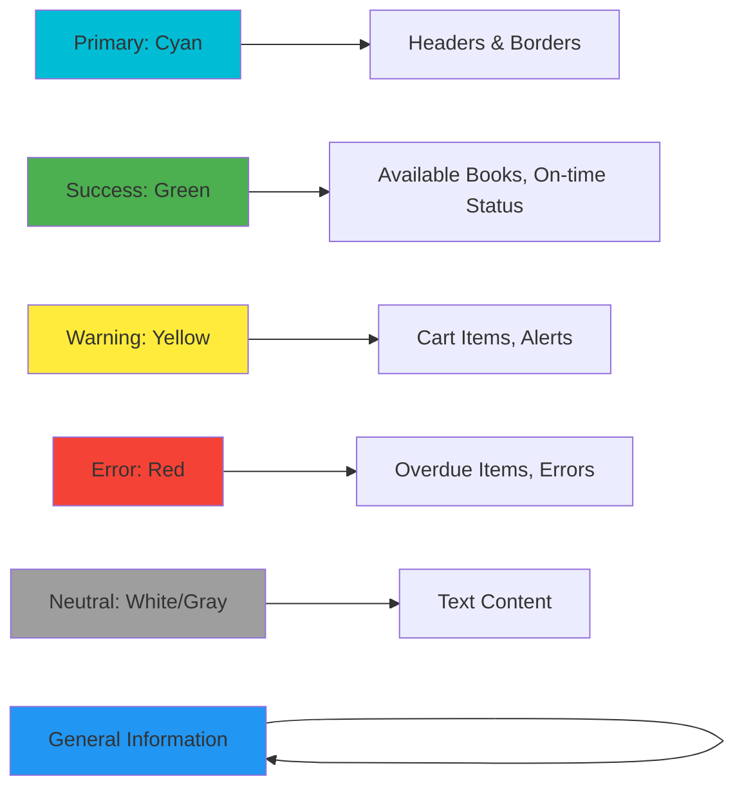

# BORK - Text User Interface (TUI) Prototype

This document presents a prototype design for the BORK (Book Organization & Rental Kiosk) text-based user interface, showing the main screens and navigation flow.

## Navigation Flow



## Screen Prototypes

### 1. Login Screen

```
╔════════════════════════════════════════════════════════════════════════╗
║                                                                        ║
║                    ██████╗  ██████╗ ██████╗ ██╗  ██╗                  ║
║                    ██╔══██╗██╔═══██╗██╔══██╗██║ ██╔╝                  ║
║                    ██████╔╝██║   ██║██████╔╝█████╔╝                   ║
║                    ██╔══██╗██║   ██║██╔══██╗██╔═██╗                   ║
║                    ██████╔╝╚██████╔╝██║  ██║██║  ██╗                  ║
║                    ╚═════╝  ╚═════╝ ╚═╝  ╚═╝╚═╝  ╚═╝                  ║
║                                                                        ║
║              Book Organization & Rental Kiosk v1.0                    ║
║                                                                        ║
╟────────────────────────────────────────────────────────────────────────╢
║                                                                        ║
║                           LOGIN TO YOUR ACCOUNT                        ║
║                                                                        ║
║   Username: [________________________________]                         ║
║                                                                        ║
║   Password: [********************************]                         ║
║                                                                        ║
║                                                                        ║
║                    [ Login ]      [ Exit ]                            ║
║                                                                        ║
║                                                                        ║
╟────────────────────────────────────────────────────────────────────────╢
║  Status:                                                               ║
╚════════════════════════════════════════════════════════════════════════╝

Arrow Keys: Navigate  |  Enter: Select  |  Tab: Next Field  |  Esc: Exit
```

### 2. Overdue Alert Screen

```
╔════════════════════════════════════════════════════════════════════════╗
║                          ⚠️  OVERDUE NOTICE  ⚠️                         ║
╟────────────────────────────────────────────────────────────────────────╢
║                                                                        ║
║  You have overdue books! Please return them as soon as possible.      ║
║                                                                        ║
║  ┌──────────────────────────────────────────────────────────────────┐ ║
║  │ Title: The Art of Computer Programming Vol. 1                   │ ║
║  │ Author: Donald Knuth                                             │ ║
║  │ Rented: 2026-03-10                                               │ ║
║  │ Due Date: 2026-04-09                                             │ ║
║  │ Days Overdue: 30 days                                            │ ║
║  └──────────────────────────────────────────────────────────────────┘ ║
║                                                                        ║
║  ┌──────────────────────────────────────────────────────────────────┐ ║
║  │ Title: Clean Code                                                │ ║
║  │ Author: Robert C. Martin                                         │ ║
║  │ Rented: 2026-03-15                                               │ ║
║  │ Due Date: 2026-04-14                                             │ ║
║  │ Days Overdue: 25 days                                            │ ║
║  └──────────────────────────────────────────────────────────────────┘ ║
║                                                                        ║
║                                                                        ║
║                         [ Acknowledge ]                               ║
║                                                                        ║
╚════════════════════════════════════════════════════════════════════════╝

Enter: Continue to Dashboard
```

### 3. Main Dashboard

```
╔════════════════════════════════════════════════════════════════════════╗
║  BORK - Main Menu                          User: john.doe    Cart: 1   ║
╟────────────────────────────────────────────────────────────────────────╢
║                                                                        ║
║  ┌─ MY CURRENT RENTALS (1/3) ────────────────────────────────────────┐ ║
║  │                                                                    │ ║
║  │  📖 Introduction to Algorithms                                    │ ║
║  │     Authors: Cormen, Leiserson, Rivest, Stein                     │ ║
║  │     Rented: 2026-05-01  |  Due: 2026-05-31  |  Days left: 22     │ ║
║  │                                                                    │ ║
║  └────────────────────────────────────────────────────────────────────┘ ║
║                                                                        ║
║  ┌─ MENU ─────────────────────────────────────────────────────────────┐ ║
║  │                                                                    │ ║
║  │  [1] 📚 Browse Books                                              │ ║
║  │                                                                    │ ║
║  │  [2] 🛒 View Cart (1 item)                                        │ ║
║  │                                                                    │ ║
║  │  [3] 📋 My Rentals                                                │ ║
║  │                                                                    │ ║
║  │  [4] 🚪 Logout                                                    │ ║
║  │                                                                    │ ║
║  └────────────────────────────────────────────────────────────────────┘ ║
║                                                                        ║
╟────────────────────────────────────────────────────────────────────────╢
║  Status: Welcome back, John!                                           ║
╚════════════════════════════════════════════════════════════════════════╝

1-4: Select Option  |  Esc: Exit
```

### 4. Browse Books Screen

```
╔════════════════════════════════════════════════════════════════════════╗
║  BORK - Browse Books                       User: john.doe    Cart: 1   ║
╟────────────────────────────────────────────────────────────────────────╢
║                                                                        ║
║  Filters: [F] Title: ______  [A] Author: ______  [C] Category: All ▼  ║
║           [R] Reset Filters                                            ║
║                                                                        ║
║  ┌────────────────────────────────────────────────────────────────────┐ ║
║  │ ► Design Patterns                                    [AVAILABLE]   │ ║
║  │   Authors: Gamma, Helm, Johnson, Vlissides                         │ ║
║  │   Category: Software Engineering  |  ISBN: 978-0201633610          │ ║
║  ├────────────────────────────────────────────────────────────────────┤ ║
║  │   The Pragmatic Programmer                           [RENTED]      │ ║
║  │   Authors: Hunt, Thomas                                            │ ║
║  │   Category: Software Engineering  |  ISBN: 978-0135957059          │ ║
║  ├────────────────────────────────────────────────────────────────────┤ ║
║  │   Artificial Intelligence: A Modern Approach         [AVAILABLE]   │ ║
║  │   Authors: Russell, Norvig                                         │ ║
║  │   Category: Computer Science  |  ISBN: 978-0134610993              │ ║
║  ├────────────────────────────────────────────────────────────────────┤ ║
║  │   Database System Concepts                           [AVAILABLE]   │ ║
║  │   Authors: Silberschatz, Korth, Sudarshan                          │ ║
║  │   Category: Databases  |  ISBN: 978-0078022159                     │ ║
║  └────────────────────────────────────────────────────────────────────┘ ║
║                                                                        ║
║  Page 1 of 5                                      Showing 4 of 18     ║
║                                                                        ║
╟────────────────────────────────────────────────────────────────────────╢
║  [Enter] Add to Cart  |  [N/P] Next/Prev  |  [B] Back  |  [Esc] Exit  ║
╚════════════════════════════════════════════════════════════════════════╝
```

### 5. View Cart Screen

```
╔════════════════════════════════════════════════════════════════════════╗
║  BORK - Rental Cart                        User: john.doe    Cart: 1   ║
╟────────────────────────────────────────────────────────────────────────╢
║                                                                        ║
║  Your Cart (1 item)                    Rental Limit: 2 slots available ║
║                                                                        ║
║  ┌────────────────────────────────────────────────────────────────────┐ ║
║  │ ► Design Patterns                                                  │ ║
║  │   Authors: Gamma, Helm, Johnson, Vlissides                         │ ║
║  │   Category: Software Engineering                                   │ ║
║  │   Added: 2026-05-09 17:45                                          │ ║
║  │                                                 [Remove from Cart]  │ ║
║  └────────────────────────────────────────────────────────────────────┘ ║
║                                                                        ║
║                                                                        ║
║                                                                        ║
║                                                                        ║
║  ┌─ CHECKOUT SUMMARY ──────────────────────────────────────────────────┐ ║
║  │                                                                    │ ║
║  │  Total Books to Rent: 1                                           │ ║
║  │  Rental Period: 30 days                                           │ ║
║  │  Due Date: 2026-06-08                                             │ ║
║  │                                                                    │ ║
║  │  Current Rentals: 1/3                                             │ ║
║  │  After Checkout: 2/3                                              │ ║
║  │                                                                    │ ║
║  └────────────────────────────────────────────────────────────────────┘ ║
║                                                                        ║
║              [ Checkout ]              [ Back to Browse ]             ║
║                                                                        ║
╟────────────────────────────────────────────────────────────────────────╢
║  [Enter] Checkout  |  [D] Remove  |  [B] Back  |  [Esc] Exit           ║
╚════════════════════════════════════════════════════════════════════════╝
```

### 6. Checkout Confirmation Screen

```
╔════════════════════════════════════════════════════════════════════════╗
║                        ✓ CHECKOUT SUCCESSFUL                           ║
╟────────────────────────────────────────────────────────────────────────╢
║                                                                        ║
║  Your books have been rented successfully!                            ║
║                                                                        ║
║  ┌─ RENTAL DETAILS ────────────────────────────────────────────────────┐ ║
║  │                                                                    │ ║
║  │  📖 Design Patterns                                               │ ║
║  │     Authors: Gamma, Helm, Johnson, Vlissides                      │ ║
║  │     Rental Date: 2026-05-09                                       │ ║
║  │     Due Date: 2026-06-08                                          │ ║
║  │     Days Remaining: 30 days                                       │ ║
║  │                                                                    │ ║
║  └────────────────────────────────────────────────────────────────────┘ ║
║                                                                        ║
║  Important Reminders:                                                 ║
║  • Please return books by the due date to avoid overdue status        ║
║  • You can rent up to 3 books at a time                               ║
║  • Current rentals: 2/3                                               ║
║                                                                        ║
║                                                                        ║
║                    [ View My Rentals ]    [ Continue ]                ║
║                                                                        ║
╟────────────────────────────────────────────────────────────────────────╢
║  [Enter] Continue  |  [M] My Rentals  |  [Esc] Exit                    ║
╚════════════════════════════════════════════════════════════════════════╝
```

### 7. My Rentals Screen

```
╔════════════════════════════════════════════════════════════════════════╗
║  BORK - My Rentals                         User: john.doe    Cart: 0   ║
╟────────────────────────────────────────────────────────────────────────╢
║                                                                        ║
║  Active Rentals (2/3)                                                 ║
║                                                                        ║
║  ┌────────────────────────────────────────────────────────────────────┐ ║
║  │ ► Introduction to Algorithms                                      │ ║
║  │   Authors: Cormen, Leiserson, Rivest, Stein                       │ ║
║  │   Category: Computer Science                                      │ ║
║  │   Rented: 2026-05-01  |  Due: 2026-05-31  |  Days left: 22       │ ║
║  │   Status: ✓ ON TIME                                               │ ║
║  │                                                    [Return Book]   │ ║
║  ├────────────────────────────────────────────────────────────────────┤ ║
║  │   Design Patterns                                                 │ ║
║  │   Authors: Gamma, Helm, Johnson, Vlissides                        │ ║
║  │   Category: Software Engineering                                  │ ║
║  │   Rented: 2026-05-09  |  Due: 2026-06-08  |  Days left: 30       │ ║
║  │   Status: ✓ ON TIME                                               │ ║
║  │                                                    [Return Book]   │ ║
║  └────────────────────────────────────────────────────────────────────┘ ║
║                                                                        ║
║  ┌─ RENTAL HISTORY ────────────────────────────────────────────────────┐ ║
║  │                                                                    │ ║
║  │  Clean Code - Robert C. Martin                                    │ ║
║  │  Rented: 2026-03-01  |  Returned: 2026-03-28  |  Status: Returned │ ║
║  │                                                                    │ ║
║  │  The Mythical Man-Month - Frederick Brooks                        │ ║
║  │  Rented: 2026-02-15  |  Returned: 2026-03-10  |  Status: Returned │ ║
║  │                                                                    │ ║
║  └────────────────────────────────────────────────────────────────────┘ ║
║                                                                        ║
╟────────────────────────────────────────────────────────────────────────╢
║  [Enter] Return Book  |  [B] Back to Menu  |  [Esc] Exit               ║
╚════════════════════════════════════════════════════════════════════════╝
```

### 8. Return Book Confirmation

```
╔════════════════════════════════════════════════════════════════════════╗
║                          CONFIRM BOOK RETURN                           ║
╟────────────────────────────────────────────────────────────────────────╢
║                                                                        ║
║  Are you sure you want to return this book?                           ║
║                                                                        ║
║  ┌────────────────────────────────────────────────────────────────────┐ ║
║  │                                                                    │ ║
║  │  📖 Introduction to Algorithms                                    │ ║
║  │     Authors: Cormen, Leiserson, Rivest, Stein                     │ ║
║  │     Category: Computer Science                                    │ ║
║  │                                                                    │ ║
║  │     Rented: 2026-05-01                                            │ ║
║  │     Due Date: 2026-05-31                                          │ ║
║  │     Days Remaining: 22 days                                       │ ║
║  │                                                                    │ ║
║  └────────────────────────────────────────────────────────────────────┘ ║
║                                                                        ║
║                                                                        ║
║  This book will be marked as returned and made available for others.  ║
║                                                                        ║
║                                                                        ║
║                    [ Confirm ]         [ Cancel ]                     ║
║                                                                        ║
║                                                                        ║
╟────────────────────────────────────────────────────────────────────────╢
║  [Y] Confirm  |  [N] Cancel  |  [Esc] Cancel                           ║
╚════════════════════════════════════════════════════════════════════════╝
```

## UI Component Legend

### Status Indicators

- `[AVAILABLE]` - Book is available for rent
- `[RENTED]` - Book is currently rented by another user
- `✓ ON TIME` - Rental is within the due date
- `⚠️ OVERDUE` - Rental has passed the due date

### Icons

- `📖` - Book
- `📚` - Browse/Library
- `🛒` - Shopping cart
- `📋` - List/Rentals
- `🚪` - Logout/Exit
- `✓` - Success/Confirmation
- `⚠️` - Warning/Alert

### Navigation Elements

- `►` - Selected item
- `▼` - Dropdown menu
- `[Button]` - Clickable action
- `______` - Text input field
- `[****]` - Password input field

## Color Scheme (for terminal with color support)



## Keyboard Navigation

| Key         | Action                                 |
| ----------- | -------------------------------------- |
| `↑/↓`       | Navigate up/down through lists         |
| `←/→`       | Navigate left/right through options    |
| `Enter`     | Select/Confirm action                  |
| `Tab`       | Move to next field/section             |
| `Shift+Tab` | Move to previous field/section         |
| `Esc`       | Go back/Cancel                         |
| `1-9`       | Quick select menu options              |
| `F/A/C`     | Quick filter shortcuts (Browse screen) |
| `Y/N`       | Yes/No confirmations                   |
| `B`         | Back to previous screen                |
| `M`         | Go to main menu                        |

## Responsive Layout Notes

- Minimum terminal size: 80 columns × 24 rows
- Recommended size: 80 columns × 30 rows
- All screens designed to fit within 80-column width
- Scrollable content areas for lists exceeding screen height
- Status bar always visible at bottom
- Header always visible at top

## Accessibility Features

1. **High Contrast Mode**: All borders and text use clear ASCII characters
2. **Screen Reader Support**: Proper labeling of all interactive elements
3. **Keyboard-Only Navigation**: No mouse required
4. **Clear Visual Hierarchy**: Boxes, borders, and spacing for clarity
5. **Status Indicators**: Text-based status (not just color-dependent)
6. **Consistent Layout**: Same structure across all screens
