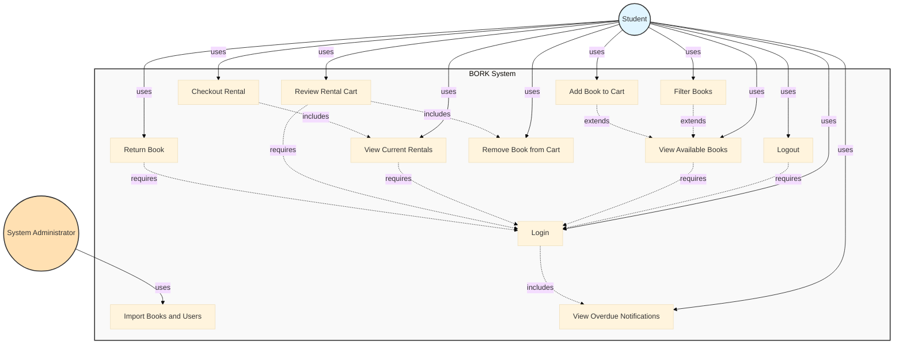

# BORK Use Case Diagram

This document presents the UML Use Case Diagram for the BORK (Book Organization & Rental Kiosk) system, illustrating the interactions between actors and the system's use cases.

## Table of Contents

- [Use Case Diagram](#use-case-diagram)
- [Actors](#actors)
  - [Primary Actors](#primary-actors)
  - [Secondary Actors](#secondary-actors)
- [Business Rules](#business-rules)
- [Use Cases](#use-cases)
  - [UC-1: Import Books and Users](#uc-1-import-books-and-users)
  - [UC-2: Login](#uc-2-login)
  - [UC-3: Logout](#uc-3-logout)
  - [UC-4: View Available Books](#uc-4-view-available-books)
  - [UC-5: Filter Books](#uc-5-filter-books)
  - [UC-6: View Current Rentals](#uc-6-view-current-rentals)
  - [UC-7: Add Book to Cart](#uc-7-add-book-to-cart)
  - [UC-8: Review Rental Cart](#uc-8-review-rental-cart)
  - [UC-9: Remove Book from Cart](#uc-9-remove-book-from-cart)
  - [UC-10: Checkout Rental](#uc-10-checkout-rental)
  - [UC-11: Return Book](#uc-11-return-book)
  - [UC-12: View Overdue Notifications](#uc-12-view-overdue-notifications)
- [Relationships](#relationships)
  - [Prerequisite Relationships](#prerequisite-relationships)
  - [Include Relationships](#include-relationships)
  - [Extend Relationships](#extend-relationships)

## Use Case Diagram

## Actors

### Primary Actors

- **Student**: A library user who can browse books, manage rentals, and receive notifications
  - Authenticated user with access to all rental and browsing features
  - Subject to rental limits (maximum 3 books, 30-day rental period)

### Secondary Actors

- **System Administrator**: External actor responsible for data management
  - Imports book inventory and user accounts via CSV/JSON files
  - No direct system interface; operates through file imports

## Business Rules

1. **Rental Limit**: Maximum 3 books per user at any time (including books in cart)
2. **Rental Period**: Maximum 30 days per rental
3. **Availability**: Books can only be added to cart if not currently rented by another user
4. **Authentication**: All use cases except UC1 require user authentication
5. **Data Management**: All data updates occur through file imports (UC1)

## Use Cases

### UC-1: Import Books and Users

**Primary actor**
System Administrator

**Secondary actors**
None

**Description**
A System Administrator imports book inventory and user account data from CSV/JSON files to populate or update the BORK system database. This is the primary method for managing data in the system without requiring an administrative interface.

**Trigger**
System Administrator has new or updated CSV/JSON files containing book or user data.

**Preconditions**
PRE-1. CSV/JSON files are properly formatted and validated.
PRE-2. System Administrator has file system access to the import directory.

**Postconditions**
POST-1. Book inventory is updated in the database.
POST-2. User accounts are created or updated in the database.
POST-3. Import log is generated with success/failure status.

**Normal flow**
1.0 Import Data

1. System Administrator places CSV/JSON file in the designated import directory.
2. System detects new file and validates file format.
3. System parses file contents and validates data integrity.
4. System updates database with book and user information.
5. System generates import log with details of imported records.
6. System moves processed file to archive directory.

**Alternative flows**
None

**Exceptions**
1.0.E1 Invalid file format

1. System detects that file format is invalid.
2. System generates error log with format validation details.
3. System moves file to error directory.
4. System terminates use case.

1.0.E2 Data integrity violation

1. System detects duplicate records or constraint violations.
2. System generates error log with specific data issues.
3. System skips invalid records and processes valid ones.
4. System generates partial import log.

**Method-level traces**
TBD (to be determined during implementation)

---

### UC-2: Login

**Primary actor**
Student

**Secondary actors**
None

**Description**
A Student authenticates with their credentials to access the BORK system. Upon successful login, the system automatically checks for and displays any overdue book notifications.

**Trigger**
Student navigates to the BORK system and requests to log in.

**Preconditions**
PRE-1. Student has a valid user account in the system.
PRE-2. Student knows their username and password.

**Postconditions**
POST-1. Student session is established.
POST-2. Student is authenticated and authorized to access system features.
POST-3. Overdue notifications are displayed if applicable.

**Normal flow**
2.0 Login

1. Student requests to log in to the system.
2. System displays login form.
3. Student enters username and password.
4. System validates credentials against database.
5. System creates authenticated session for Student.
6. System checks for overdue book rentals (see UC-12).
7. System displays main dashboard with book browsing interface.

**Alternative flows**
None

**Exceptions**
2.0.E1 Invalid credentials

1. System detects that username or password is incorrect.
2. System displays error message indicating invalid credentials.
3. System returns to step 2 of normal flow.
4. If Student fails authentication 3 times, system locks account temporarily.

2.0.E2 Account locked

1. System detects that account is locked due to multiple failed attempts.
2. System displays message indicating account is locked.
3. System terminates use case.

**Method-level traces**
TBD (to be determined during implementation)

---

### UC-3: Logout

**Primary actor**
Student

**Secondary actors**
None

**Description**
A Student securely terminates their authenticated session in the BORK system.

**Trigger**
Student requests to log out of the system.

**Preconditions**
PRE-1. Student is logged in to the system.

**Postconditions**
POST-1. Student session is terminated.
POST-2. Student is redirected to login page.

**Normal flow**
3.0 Logout

1. Student requests to log out.
2. System invalidates current session.
3. System clears any temporary data associated with the session.
4. System redirects Student to login page.
5. System displays confirmation message.

**Alternative flows**
None

**Exceptions**
None

**Method-level traces**
TBD (to be determined during implementation)

---

### UC-4: View Available Books

**Primary actor**
Student

**Secondary actors**
None

**Description**
A Student views a complete list of books available in the library. The list displays book details including title, author, category, and availability status.

**Trigger**
Student navigates to the book browsing interface.

**Preconditions**
PRE-1. Student is logged in to the system.

**Postconditions**
POST-1. Complete book list is displayed to Student.
POST-2. Book availability status is shown for each book.

**Normal flow**
4.0 View Available Books

1. Student requests to view available books.
2. System retrieves book list from database.
3. System retrieves current rental status for all books.
4. System displays book list with title, author, category, and availability status.
5. Student browses the book list. (see 4.1, 4.2)

**Alternative flows**
4.1 Filter Books (see UC-5)

1. Student applies filters to narrow down book list.
2. Return to step 4 of normal flow with filtered results.

4.2 Add Book to Cart (see UC-7)

1. Student selects a book to add to rental cart.
2. Continue with UC-7.

**Exceptions**
None

**Method-level traces**
TBD (to be determined during implementation)

---

### UC-5: Filter Books

**Primary actor**
Student

**Secondary actors**
None

**Description**
A Student applies filters to narrow down the book list by title, author, or category to find specific books more easily.

**Trigger**
Student requests to filter the book list while viewing available books.

**Preconditions**
PRE-1. Student is logged in to the system.
PRE-2. Student is viewing the book list (UC-4).

**Postconditions**
POST-1. Filtered book list is displayed.
POST-2. Filter criteria are preserved during the session.

**Normal flow**
5.0 Filter Books

1. Student requests to apply filters.
2. System displays filter options (title, author, category).
3. Student selects filter type and enters filter criteria.
4. System applies filter to book list.
5. System displays filtered results.
6. Student views filtered book list. (see 5.1, 5.2)

**Alternative flows**
5.1 Clear filters

1. Student requests to clear all filters.
2. System removes all filter criteria.
3. Return to step 4 of UC-4 normal flow.

5.2 Modify filters

1. Student requests to modify filter criteria.
2. Return to step 2 of normal flow.

**Exceptions**
5.0.E1 No results found

1. System finds no books matching filter criteria.
2. System displays message indicating no results.
3. System prompts Student to modify filter criteria.
4. Return to step 2 of normal flow.

**Method-level traces**
TBD (to be determined during implementation)

---

### UC-6: View Current Rentals

**Primary actor**
Student

**Secondary actors**
None

**Description**
A Student views all books they currently have rented, including rental dates, due dates, and overdue status.

**Trigger**
Student navigates to their current rentals section or system automatically displays rentals.

**Preconditions**
PRE-1. Student is logged in to the system.

**Postconditions**
POST-1. Current rentals are displayed with rental dates and status.
POST-2. Overdue status is clearly indicated for late returns.

**Normal flow**
6.0 View Current Rentals

1. Student requests to view current rentals or system displays them automatically.
2. System retrieves all active rentals for the Student.
3. System calculates rental duration and due dates.
4. System determines if any rentals are overdue.
5. System displays rental list at top of interface with:
   - Book title and author
   - Rental start date
   - Due date (30 days from rental)
   - Overdue indicator if applicable
6. Student views rental information.

**Alternative flows**
None

**Exceptions**
6.0.E1 No current rentals

1. System detects Student has no active rentals.
2. System displays message indicating no current rentals.
3. System terminates use case.

**Method-level traces**
TBD (to be determined during implementation)

---

### UC-7: Add Book to Cart

**Primary actor**
Student

**Secondary actors**
None

**Description**
A Student adds an available book to their rental cart in preparation for checkout. The system validates availability and rental limits before adding the book.

**Trigger**
Student selects a book and requests to add it to the rental cart.

**Preconditions**
PRE-1. Student is logged in to the system.
PRE-2. Student is viewing available books (UC-4).
PRE-3. Selected book is currently available (not rented by another user).
PRE-4. Student has not reached the 3-book rental limit (including current rentals and cart items).

**Postconditions**
POST-1. Book is added to Student's rental cart.
POST-2. Cart item count is updated.

**Normal flow**
7.0 Add Book to Cart

1. Student selects a book from the available books list.
2. Student requests to add book to cart.
3. System checks book availability status.
4. System checks Student's current rental count (active rentals + cart items).
5. System validates that adding this book will not exceed 3-book limit.
6. System adds book to rental cart.
7. System displays confirmation message.
8. System updates cart item count display.

**Alternative flows**
None

**Exceptions**
7.0.E1 Book not available

1. System detects book is currently rented by another user.
2. System displays message indicating book is unavailable.
3. System terminates use case.

7.0.E2 Rental limit reached

1. System detects Student already has 3 books (rented + in cart).
2. System displays message indicating rental limit reached.
3. System suggests returning books or removing items from cart.
4. System terminates use case.

**Method-level traces**
TBD (to be determined during implementation)

---

### UC-8: Review Rental Cart

**Primary actor**
Student

**Secondary actors**
None

**Description**
A Student reviews all books currently in their rental cart before proceeding to checkout. The Student can view cart contents, remove items, or proceed to finalize the rental.

**Trigger**
Student navigates to the rental cart or requests to review cart before checkout.

**Preconditions**
PRE-1. Student is logged in to the system.

**Postconditions**
POST-1. Cart contents are displayed to Student.
POST-2. Student can proceed to checkout or modify cart.

**Normal flow**
8.0 Review Rental Cart

1. Student requests to view rental cart.
2. System retrieves all items in Student's cart.
3. System displays cart with book details (title, author, category).
4. System displays total number of items in cart.
5. Student reviews cart contents. (see 8.1, 8.2)

**Alternative flows**
8.1 Remove book from cart (see UC-9)

1. Student selects a book to remove from cart.
2. Continue with UC-9.
3. Return to step 2 of normal flow.

8.2 Proceed to checkout (see UC-10)

1. Student confirms cart and requests to checkout.
2. Continue with UC-10.

**Exceptions**
8.0.E1 Empty cart

1. System detects cart is empty.
2. System displays message indicating cart is empty.
3. System prompts Student to browse books.
4. System terminates use case.

**Method-level traces**
TBD (to be determined during implementation)

---

### UC-9: Remove Book from Cart

**Primary actor**
Student

**Secondary actors**
None

**Description**
A Student removes a book from their rental cart before checkout.

**Trigger**
Student selects a book in the cart and requests to remove it.

**Preconditions**
PRE-1. Student is logged in to the system.
PRE-2. Student has at least one book in the rental cart.

**Postconditions**
POST-1. Selected book is removed from cart.
POST-2. Cart item count is updated.

**Normal flow**
9.0 Remove Book from Cart

1. Student selects a book in the cart.
2. Student requests to remove the book.
3. System prompts for confirmation.
4. Student confirms removal.
5. System removes book from cart.
6. System updates cart item count.
7. System displays confirmation message.

**Alternative flows**
9.1 Cancel removal

1. Student cancels removal at confirmation prompt.
2. System terminates use case without changes.

**Exceptions**
None

**Method-level traces**
TBD (to be determined during implementation)

---

### UC-10: Checkout Rental

**Primary actor**
Student

**Secondary actors**
None

**Description**
A Student finalizes the rental of all books in their cart. The system creates rental records, updates book availability, clears the cart, and displays the updated current rentals.

**Trigger**
Student confirms cart contents and requests to complete the checkout.

**Preconditions**
PRE-1. Student is logged in to the system.
PRE-2. Student has at least one book in the rental cart.
PRE-3. Total books (current rentals + cart items) does not exceed 3.
PRE-4. All books in cart are still available.

**Postconditions**
POST-1. Rental records are created for all books in cart.
POST-2. Book availability status is updated to "rented".
POST-3. Rental cart is cleared.
POST-4. Current rentals display is updated (UC-6).

**Normal flow**
10.0 Checkout Rental

1. Student requests to checkout from cart review.
2. System validates all books in cart are still available.
3. System validates total rental count does not exceed 3.
4. System creates rental records with:
   - Student ID
   - Book ID
   - Rental start date (current date)
   - Due date (30 days from current date)
   - Status: "active"
5. System updates book availability status to "rented".
6. System clears rental cart.
7. System displays current rentals (UC-6).
8. System displays success message with rental details and due dates.

**Alternative flows**
None

**Exceptions**
10.0.E1 Book no longer available

1. System detects one or more books in cart were rented by another user.
2. System displays message listing unavailable books.
3. System removes unavailable books from cart.
4. System prompts Student to review updated cart.
5. Return to step 2 of UC-8.

   10.0.E2 Rental limit would be exceeded

6. System detects checkout would exceed 3-book limit.
7. System displays error message.
8. System prompts Student to remove items from cart.
9. System terminates use case.

**Method-level traces**
TBD (to be determined during implementation)

---

### UC-11: Return Book

**Primary actor**
Student

**Secondary actors**
None

**Description**
A Student returns a rented book, making it available for other users to rent. The system updates the rental record and book availability status.

**Trigger**
Student selects a rented book and requests to return it.

**Preconditions**
PRE-1. Student is logged in to the system.
PRE-2. Student has at least one active rental.

**Postconditions**
POST-1. Rental record is updated with return date and status "returned".
POST-2. Book availability status is updated to "available".
POST-3. Book appears in available books list.

**Normal flow**
11.0 Return Book

1. Student views current rentals (UC-6).
2. Student selects a book to return.
3. Student requests to return the book.
4. System prompts for confirmation.
5. Student confirms return.
6. System updates rental record with:
   - Return date (current date)
   - Status: "returned"
7. System updates book availability status to "available".
8. System removes book from current rentals display.
9. System displays confirmation message.

**Alternative flows**
11.1 Cancel return

1. Student cancels return at confirmation prompt.
2. System terminates use case without changes.

**Exceptions**
None

**Method-level traces**
TBD (to be determined during implementation)

---

### UC-12: View Overdue Notifications

**Primary actor**
Student

**Secondary actors**
None

**Description**
The system automatically checks for overdue book rentals when a Student logs in and displays notifications for any books past their return date.

**Trigger**
Student successfully logs in to the system (UC-2).

**Preconditions**
PRE-1. Student is logging in to the system.
PRE-2. Student has an active session being established.

**Postconditions**
POST-1. Overdue notifications are displayed if applicable.
POST-2. Student is aware of any overdue rentals.

**Normal flow**
12.0 View Overdue Notifications

1. System retrieves all active rentals for Student.
2. System calculates due dates (rental date + 30 days).
3. System compares due dates with current date.
4. System identifies rentals where current date > due date.
5. If overdue rentals exist, system displays notification with:
   - Book title and author
   - Rental date
   - Due date
   - Number of days overdue
6. Student acknowledges notification.
7. System proceeds to main dashboard.

**Alternative flows**
12.1 No overdue rentals

1. System finds no overdue rentals.
2. System skips notification display.
3. System proceeds to main dashboard.

**Exceptions**
None

**Method-level traces**
TBD (to be determined during implementation)

## Relationships

### Prerequisite Relationships

- **UC2 (Login) is required for all student use cases**: All student functionality requires authentication
  - UC3 (Logout) requires UC2
  - UC4 (View Available Books) requires UC2
  - UC6 (View Current Rentals) requires UC2
  - UC8 (Review Rental Cart) requires UC2
  - UC11 (Return Book) requires UC2
  - UC12 (View Overdue Notifications) requires UC2
  - Note: UC5, UC7, UC9, UC10, UC12 indirectly require UC2 through their parent use cases

### Include Relationships

- **UC2 (Login) includes UC12 (View Overdue Notifications)**: When a user logs in, the system automatically checks and displays overdue notifications
- **UC8 (Review Rental Cart) includes UC9 (Remove Book from Cart)**: Reviewing the cart inherently provides the ability to remove items
- **UC10 (Checkout Rental) includes UC6 (View Current Rentals)**: After checkout, the system updates and displays current rentals

### Extend Relationships

- **UC7 (Add Book to Cart) extends UC4 (View Available Books)**: Adding to cart is an optional action while viewing books
- **UC5 (Filter Books) extends UC4 (View Available Books)**: Filtering is an optional enhancement to book viewing
